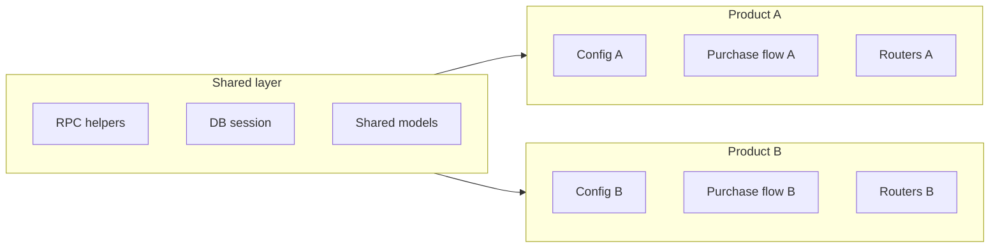

# Keeping two similar products without losing your mind

You already have one codebase ([`/Users/sachin/Developer/Xfee-Sales-TAGPLAN`](file:///Users/sachin/Developer/Xfee-Sales-TAGPLAN)): Python + `requirements.txt` + [`app/`](file:///Users/sachin/Developer/Xfee-Sales-TAGPLAN/app). The other project will share *structure* and *some* logic but diverge in rules, config, and endpoints. Below are the main patterns that work in practice.

## Option A — Second repo + upstream remote (fork-style)

**What:** Copy or fork the repo into a new directory/repo. Add the original as `git remote add upstream <url>` and periodically `git fetch upstream` and merge/rebase selected commits.

**Best when:** Products diverge a lot (different branding, DB, deploy), but you still want occasional bugfixes and refactors from the “parent” codebase.

**Pros:** Simple mental model; two independent deploy pipelines; no forced coupling.  
**Cons:** Merge conflicts when both sides touch the same files; you must be disciplined about what you cherry-pick.

### How to start with Option A (bootstrap)

Goal: **child repo** has `origin` → its own Git remote (deploy/PRs here), and **`upstream`** → the original repo (pull shared fixes from here).

1. **Make the parent repo canonical** — Push the current `main` (or your default branch) to the parent remote so `upstream` always has a known baseline.

2. **Create an empty child remote** — New empty repo on GitHub/GitLab (no auto-generated README/license if you want a clean first push from clone).

3. **Clone and wire remotes** (recommended one-shot layout):

   - `git clone <PARENT_URL> <new-folder>`
   - `cd <new-folder>`
   - `git remote rename origin upstream`
   - `git remote add origin <CHILD_URL>`
   - `git push -u origin main` (or your default branch name)

   Result: **`git push` / PRs** use `origin` (product B). **`git fetch upstream`** pulls from product A without mixing them up.

4. **Productize the copy immediately** — In the child repo, change anything that must never collide: app name in README, image/service names in [`Dockerfile`](file:///Users/sachin/Developer/Xfee-Sales-TAGPLAN/Dockerfile) / compose / CI, env var prefixes, and defaults in [`app/config.py`](file:///Users/sachin/Developer/Xfee-Sales-TAGPLAN/app/config.py). Do this in the **first** child commit so the diff from parent stays obvious.

5. **Day-to-day sync** — When you want changes from A into B:

   - `git fetch upstream`
   - Prefer **merge** (`git merge upstream/main`) for periodic catch-ups, or **`git cherry-pick <sha>`** when you only want specific fixes.
   - If merges get painful, merge **more often** with smaller batches; that beats giant annual merges.

6. **Optional safety** — For big upstream merges, use a short-lived branch (`sync/upstream-2026-05-16`), run tests, then merge to `main`—keeps `main` deployable.

**Avoid:** editing both repos in the same files for unrelated reasons without merging— that maximizes conflicts. Prefer isolating product B logic in clearly “owned” files (config, one router module, one service module) as described in *What usually works* below.

### Copy directory, delete `.git`, `git init` — is that OK?

**Yes, if you want a clean break** (new history, no inherited commits). Treat it like **Option D** (template): you are not preserving a first-class Git link to the parent.

**What you gain**

- A **new** history (often one initial commit), which can be nice if you want a simple linear story or to leave behind messy or sensitive old commits in *this* new repo’s history (note: anything you already pushed to the parent remote is still there on the parent).
- **No stale `origin`** in `.git` — zero risk of pushing product B to product A’s remote by habit (you still must not commit secrets).

**What you give up vs clone + `upstream`**

- Parent and child commits **no longer share ancestry**, so the usual `git fetch upstream` → `git merge upstream/main` workflow does **not** apply cleanly. Connecting later means **unrelated histories** (`--allow-unrelated-histories`) or manual file-level ports / diffs — usually worse than cloning once with remotes wired correctly.

**Practical gotchas when copy-pasting the folder**

- Copy **build artifacts and local env** by mistake: `.venv`, `__pycache__`, `node_modules`, `.env`, editor junk. Prefer copy from a clean tree or delete those before the first commit; honour `.gitignore`.
- If you still want a **read-only** reference to the parent repo, keep a normal clone elsewhere, or add the parent URL only for `git fetch` + manual comparison — not as a routine merge source unless you redo the bootstrap with a proper clone.

**Rule of thumb:** copy + reinit = **independent product**; clone + rename remotes = **product B that can merge fixes from A**. Pick based on whether you need that merge path in the next year.

## Option B — Monorepo (`apps/tagplan`, `apps/other`, `packages/core`)

**What:** One git repo with two deployable apps and a shared internal package (e.g. `packages/sales_core` installed with `pip install -e` or a workspace layout).

**Best when:** One team owns both, you want one CI, shared types/models, and refactors that apply to both in one PR.

**Pros:** True single source for shared modules; refactors stay consistent.  
**Cons:** Repo size and CI complexity; you need clear boundaries so “product B” does not accidentally depend on “product A” internals.

## Option C — Shared library (private package or git dependency)

**What:** Extract stable, generic pieces (RPC helpers, auth patterns, DB session, shared models) into `sales-platform-core` published to a private index or installed via `pip install git+https://...` / submodule.

**Best when:** You expect *many* consumers or long-term reuse, and the “core” API can stay relatively stable.

**Pros:** Strongest reuse boundary; version pinning per product.  
**Cons:** Highest upfront extraction cost; every shared change needs a release/bump workflow.

## Option D — Template only (copy once, then independent)

**What:** Treat the current repo as a template; new project starts from a snapshot and you do **not** plan systematic merges.

**Best when:** The second product will quickly become very different and you rarely need cross-porting.

**Pros:** Zero ongoing merge tax.  
**Cons:** Duplicated bugs and duplicated fixes unless you manually port.

---

## How to choose (short decision guide)

| Situation | Lean toward |
|-----------|-------------|
| Two products, same team, frequent shared fixes | **B Monorepo** or **C Library** |
| Two products, different lifecycles/deploys, moderate sharing | **A Fork + upstream** |
| One-off spinoff, little future coupling | **D Template** |

---

## What usually works for “same system, different logic” in *this* stack

Regardless of A–D, **push divergence to the edges**:

- **Config/env** — URLs, token mints, feature flags ([`app/config.py`](file:///Users/sachin/Developer/Xfee-Sales-TAGPLAN/app/config.py)-style).
- **Strategy / plugin boundaries** — e.g. tranche rules ([`app/utils/tranche.py`](file:///Users/sachin/Developer/Xfee-Sales-TAGPLAN/app/utils/tranche.py)), purchase flow ([`app/services/purchase_flow.py`](file:///Users/sachin/Developer/Xfee-Sales-TAGPLAN/app/services/purchase_flow.py)) as swappable modules per product.
- **Routers** — product-specific HTTP surface in separate router modules; shared middleware in common code.

That way “logic change” is localized files or a small `product_x/` package instead of `#ifdef` style conditionals scattered everywhere.

### Your second product: commission + POWER (where it lives today)

These are the main touchpoints in *this* repo so you can treat them as an explicit checklist when you fork or copy the child project.

**Commission structure**

- **Pool size / cap** — [`app/services/commission.py`](file:///Users/sachin/Developer/Xfee-Sales-TAGPLAN/app/services/commission.py): `TOTAL_COMMISSION_RATE = 0.30` and the pool math (`total_sol_received * TOTAL_COMMISSION_RATE`).
- **Per-level rates (differential commissions)** — [`app/utils/level.py`](file:///Users/sachin/Developer/Xfee-Sales-TAGPLAN/app/utils/level.py): `get_rate_for_level` and tier thresholds.
- **What counts as “commissionable” SOL** — [`app/utils/tranche.py`](file:///Users/sachin/Developer/Xfee-Sales-TAGPLAN/app/utils/tranche.py) (gross vs deductible tranches) plus [`app/services/purchase_flow.py`](file:///Users/sachin/Developer/Xfee-Sales-TAGPLAN/app/services/purchase_flow.py) (`commissionable_sol = purchase_value_sol - (deduction_usd / sol_price)`).
- **Sweep / leftover accounting** — [`app/services/purchase_flow.py`](file:///Users/sachin/Developer/Xfee-Sales-TAGPLAN/app/services/purchase_flow.py) uses a hardcoded `0.30` for `commission_pool` in one path; keep it in sync with whatever total rate you adopt.
- **Admin audit / resume** — [`app/routers/admin.py`](file:///Users/sachin/Developer/Xfee-Sales-TAGPLAN/app/routers/admin.py) encodes expectations (rates, totals); update when commission rules change or audits will disagree with reality.
- **Indexing / user totals** — [`app/services/indexer.py`](file:///Users/sachin/Developer/Xfee-Sales-TAGPLAN/app/services/indexer.py) aggregates `alloc_type: commission` documents; usually no formula change unless you change alloc shape.

**POWER staked per purchase**

- **Default stake amount** — today tied to **`xfee_amount * 10`** in [`app/services/stake_repair.py`](file:///Users/sachin/Developer/Xfee-Sales-TAGPLAN/app/services/stake_repair.py) and admin helpers, and **`sale_usd * 10`** in [`app/services/purchase_flow.py`](file:///Users/sachin/Developer/Xfee-Sales-TAGPLAN/app/services/purchase_flow.py) for the purchase path. Any new multiplier or rule should update **both** (and admin “expected POWER” strings) so repair, flow, and audits stay aligned.
- **On-chain call** — [`app/services/staking_sdk.py`](file:///Users/sachin/Developer/Xfee-Sales-TAGPLAN/app/services/staking_sdk.py) (implementation detail; amount is passed in from callers above).

**Child-repo hygiene:** After you change rates or POWER math, grep for `0.30`, `* 10`, and `commission_pool` so you do not leave one stale hardcoded path.

### Handoff plan for the new repo economics

Use this section as the documentation for the next agent after creating the child repo. The intended approach is:

- The new repo is an independent product copy.
- Commission remains **cumulative differential** like the current system.
- The rank table becomes **Rank 1-15**.
- The maximum cumulative commission rate becomes **100%**.
- POWER staking changes from **10x purchase amount** to **20x purchase amount**.

#### New commission table

| Type | Rank | Cumulative Rate | Target |
|------|------|-----------------|--------|
| Public | 1 | 20% | 0 |
| Public | 2 | 22% | 500 |
| Public | 3 | 24% | 2,500 |
| Public | 4 | 26% | 10,000 |
| Public | 5 | 28% | 25,000 |
| Public | 6 | 30% | 50,000 |
| Public | 7 | 32% | 100,000 |
| Public | 8 | 34% | 250,000 |
| Public | 9 | 36% | 1,000,000 |
| Public | 10 | 40% | 2,500,000 |
| Private | 11 | 45% | 1,000,000,000 |
| Owner 1 | 12 | 60% | 3,000,000,000 |
| Owner 2 | 13 | 75% | 5,000,000,000 |
| Buy Back | 14 | 95% | 9,000,000,000 |
| Global Pool | 15 | 100% | 10,000,000,000 |

Implementation note: the existing code treats `LEVEL_THRESHOLDS` as descending `(rank, target, cumulative_rate)` tuples and pays each ancestor the difference between their rate and the highest already-paid ancestor rate.

#### Exact code changes for commission

1. Update [`app/utils/level.py`](file:///Users/sachin/Developer/Xfee-Sales-TAGPLAN/app/utils/level.py).

   Replace the current Rank 1-8 table with the new Rank 1-15 table, sorted highest target first:

   ```python
   LEVEL_THRESHOLDS = [
       (15, 10_000_000_000.0, 1.00),
       (14, 9_000_000_000.0, 0.95),
       (13, 5_000_000_000.0, 0.75),
       (12, 3_000_000_000.0, 0.60),
       (11, 1_000_000_000.0, 0.45),
       (10, 2_500_000.0, 0.40),
       (9, 1_000_000.0, 0.36),
       (8, 250_000.0, 0.34),
       (7, 100_000.0, 0.32),
       (6, 50_000.0, 0.30),
       (5, 25_000.0, 0.28),
       (4, 10_000.0, 0.26),
       (3, 2_500.0, 0.24),
       (2, 500.0, 0.22),
       (1, 0.0, 0.20),
   ]
   ```

2. Update [`app/services/commission.py`](file:///Users/sachin/Developer/Xfee-Sales-TAGPLAN/app/services/commission.py).

   - Change `TOTAL_COMMISSION_RATE = 0.30` to `TOTAL_COMMISSION_RATE = 1.00`.
   - Change the cap check from `highest_level_paid_so_far >= 8` to `highest_level_paid_so_far >= 15`.
   - Keep the differential formula unchanged:

   ```python
   differential_rate = get_rate_for_level(ancestor_level) - get_rate_for_level(highest_level_paid_so_far)
   commission_sol = total_sol_received * differential_rate
   ```

3. Update [`app/services/purchase_flow.py`](file:///Users/sachin/Developer/Xfee-Sales-TAGPLAN/app/services/purchase_flow.py).

   - Replace the hardcoded sweep/accounting `0.30` with the shared total commission rate (`1.00`) or import `TOTAL_COMMISSION_RATE` from `app.services.commission`.
   - Verify `target_sweep_lamports = int((commissionable_sol - total_distributed) * 1e9)` still matches the desired behavior: after commissions, any undistributed commissionable SOL is swept to the master wallet.

4. Update [`app/routers/admin.py`](file:///Users/sachin/Developer/Xfee-Sales-TAGPLAN/app/routers/admin.py).

   - Any audit code that expects the old max level/rate must accept Rank 15 and 100%.
   - Existing calls to `get_rate_for_level()` should automatically use the new table, but explicit comments, response strings, and assumptions around Rank 8 / 40% need review.

5. Confirm [`app/services/indexer.py`](file:///Users/sachin/Developer/Xfee-Sales-TAGPLAN/app/services/indexer.py) does not need formula changes.

   It aggregates stored `commission` allocs and should keep working if alloc shape is unchanged.

#### Exact code changes for POWER 20x

Replace every default POWER calculation from `amount * 10` to `amount * 20`.

Known places:

- [`app/services/purchase_flow.py`](file:///Users/sachin/Developer/Xfee-Sales-TAGPLAN/app/services/purchase_flow.py): `power_amount = int(sale_usd * 10)` becomes `int(sale_usd * 20)`.
- [`app/services/stake_repair.py`](file:///Users/sachin/Developer/Xfee-Sales-TAGPLAN/app/services/stake_repair.py): `int(float(xfee_amount) * 10)` becomes `int(float(xfee_amount) * 20)`.
- [`app/routers/admin.py`](file:///Users/sachin/Developer/Xfee-Sales-TAGPLAN/app/routers/admin.py): update all expected POWER calculations, response notes, endpoint descriptions, and audit helpers from `xfee_amount * 10` to `xfee_amount * 20`.

Recommended cleanup: introduce a single constant or helper so future edits do not require grep everywhere:

```python
POWER_STAKE_MULTIPLIER = 20


def calculate_power_amount(purchase_amount_usd: float) -> int:
    return int(float(purchase_amount_usd) * POWER_STAKE_MULTIPLIER)
```

Put it in either [`app/config.py`](file:///Users/sachin/Developer/Xfee-Sales-TAGPLAN/app/config.py) as a setting, or in a small new utility module such as `app/utils/economics.py`. Prefer the utility module if tests will import it directly.

#### New-repo creation steps for the next agent

If choosing the simple copy-and-reinit route:

1. Copy the project directory to a new folder.
2. Delete the copied folder's `.git`.
3. Delete local artifacts before first commit: `.venv`, `__pycache__`, `.pytest_cache`, `.env`, generated CSVs/state files if not needed.
4. Run `git init`.
5. Create a new empty remote repo.
6. Add remote: `git remote add origin <NEW_REPO_URL>`.
7. Make the first commit after productizing names/configs and adding this economics migration.

If the child repo may need parent fixes later, prefer the clone/upstream workflow described above instead of deleting `.git`.

#### Grep checklist after implementation

Run searches in the child repo and ensure every hit is intentional:

- `0.30`
- `0.40`
- `>= 8`
- `LEVEL_THRESHOLDS`
- `TOTAL_COMMISSION_RATE`
- `* 10`
- `xfee_amount * 10`
- `sale_usd * 10`
- `expected_power_units`
- `commission_pool`

#### Verification checklist

Commission behavior to verify:

- Rank 1 gets 20%.
- Rank 2 after Rank 1 gets 2% differential.
- Rank 10 after Rank 9 gets 4% differential.
- Rank 15 after Rank 14 gets 5% differential.
- A direct jump from no paid ancestor to Rank 15 pays 100%.
- Once Rank 15 is paid, later ancestors get zero.
- `TOTAL_COMMISSION_RATE` is 100% in logging/audit math.

POWER behavior to verify:

- A $100 purchase stakes `2000` POWER units.
- The background repair worker calculates the same `2000` POWER units for the same purchase.
- Admin audit endpoints show expected POWER as `xfee_amount * 20`.

Admin/audit behavior to verify:

- Commission audit reports the new expected percentages.
- No endpoint still describes the old 10x POWER rule.
- No endpoint still assumes Rank 8 is the maximum rank.



---

## Recommended default for most teams

If you are unsure: start with **Option A (second repo + `upstream`)** while you learn what is truly shared. After 2–4 weeks, if you keep merging the same files, **migrate to B or C** with a deliberate extraction of the shared layer—avoid premature abstraction on day one.

---

## Clarification that changes the recommendation

If you answer one thing, it sharpens the advice: **Will you need to port fixes/features from project 1 to project 2 at least monthly?** If yes → monorepo or library becomes attractive quickly. If no → fork or template is enough.

(No code changes in this plan; when you pick an option, implementation is: new remote or new repo layout + boundary refactors as above.)
